<!-- Generated by scripts/render_readme_cards.py. Edit the script, not this file.
     Keep images in a row on one line with no spaces between them. -->

<a href="https://github.com/abdullahmran-101">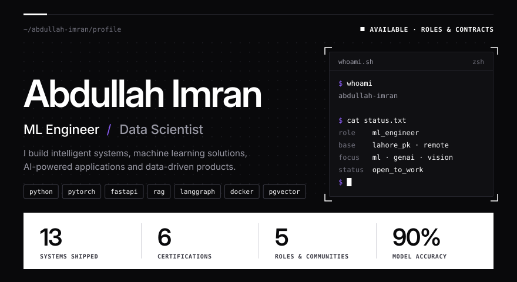</a> 
 
 
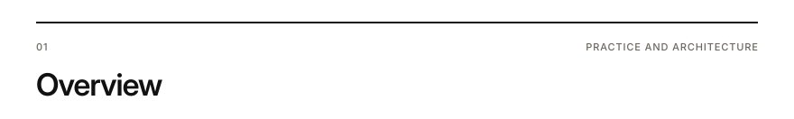 
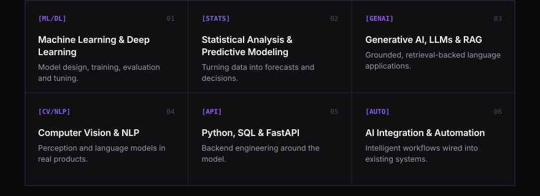 
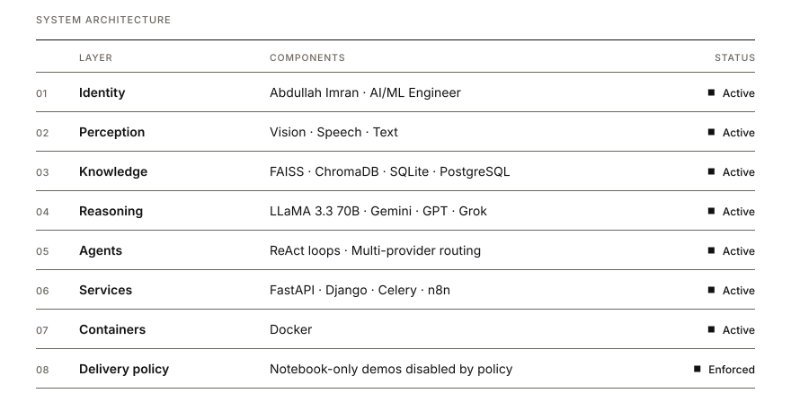 
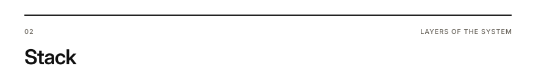 
 
 
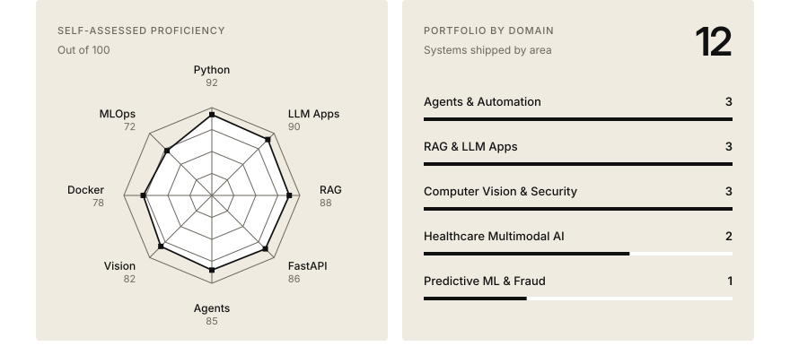 
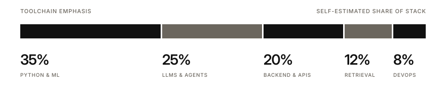 
 
 
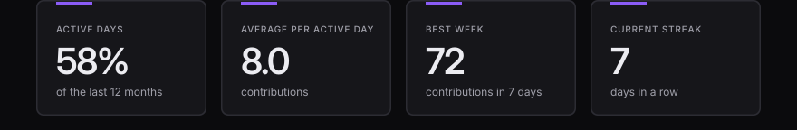 
 
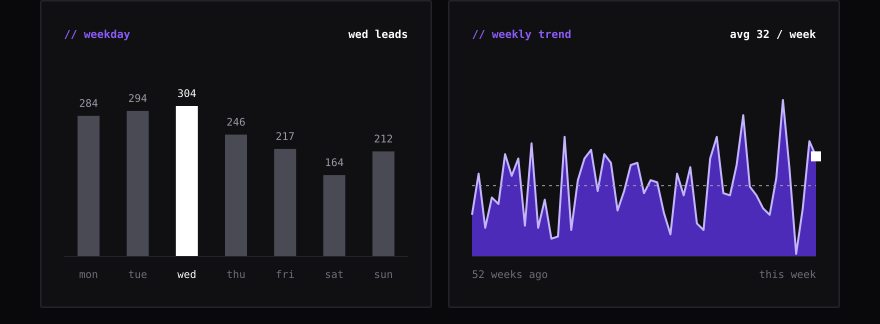 
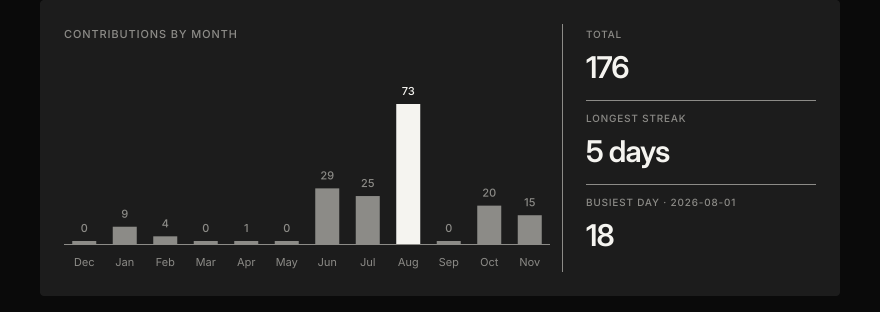 
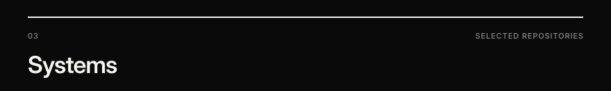 
<a href="https://github.com/abdullahmran-101/Heal-Matrix-AI">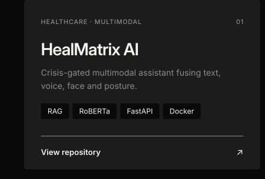</a> 
<a href="https://github.com/abdullahmran-101/Research-Forge-AI">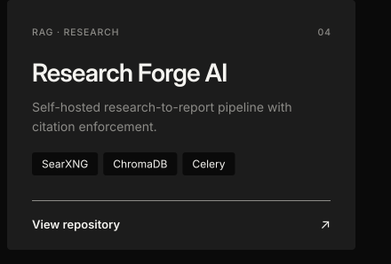</a> 
 
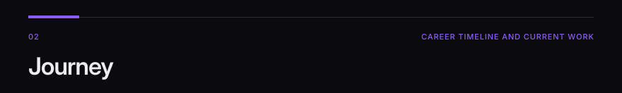 
 
 
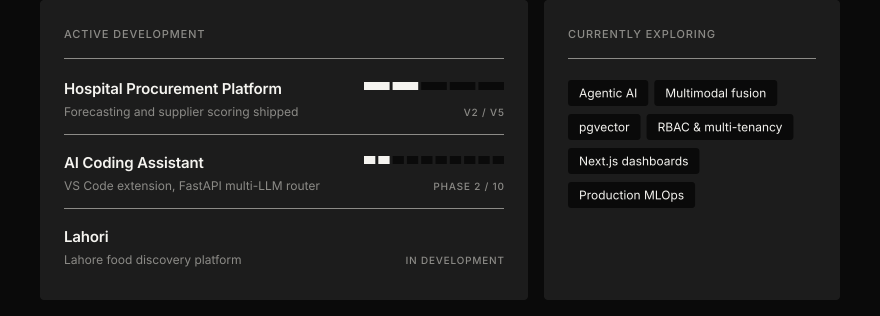 
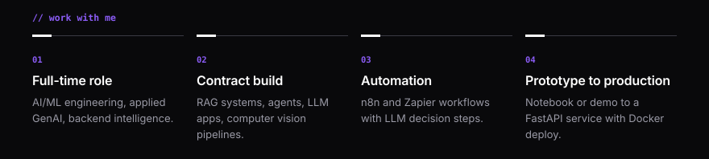 
 
<a href="https://github.com/abdullahmran-101">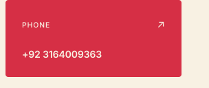</a> 

